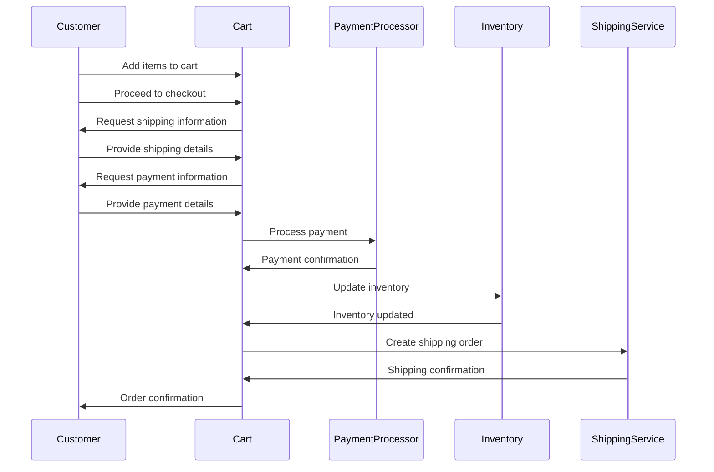

# mermaid-this

A CLI tool to generate mermaid diagrams for code files.

## Installation

```bash
# Clone the repository
git clone https://github.com/yourusername/mermaid-this.git
cd mermaid-this

# Install dependencies
bun install

# Link the CLI for development
bun link
```

## Usage

```bash
# Generate a mermaid diagram for a file
mermaid-this path/to/file.js > diagram.md

# Specify the output file
mermaid-this path/to/file.js -o diagram.md

# Specify the diagram type
mermaid-this path/to/file.js -t class
```

## Supported Diagram Types

- `sequence` (default): Generate a sequence diagram
- `class`: Generate a class diagram
- `flowchart`: Generate a flowchart diagram

## Supported File Types

The tool can analyze various code file types, including:
- JavaScript (.js)
- TypeScript (.ts, .tsx)
- Java (.java)
- Rust (.rs)
- Bash (.sh)
- And more...

## Example

Input file:
```javascript
function checkout(cart, paymentInfo) {
  const order = createOrder(cart);
  const payment = processPayment(paymentInfo);
  if (payment.success) {
    updateInventory(cart);
    createShipping(order);
    return { success: true, orderId: order.id };
  }
  return { success: false, error: payment.error };
}
```

Output:


## License

MIT
