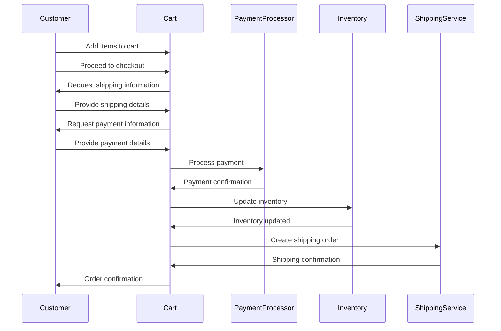

# mermaid-this

A cli tool to generate mermaid diagrams for documents.

## Example usage

```bash
mermaid-this somefile.tsx > somefile.md
```

This will generate a mermaid document, something like this:


