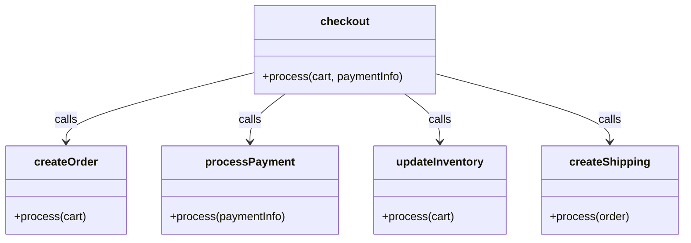

```mermaid
classDiagram
    class createOrder {
        +process(cart)
    }
    class processPayment {
        +process(paymentInfo)
    }
    class updateInventory {
        +process(cart)
    }
    class createShipping {
        +process(order)
    }
    class checkout {
        +process(cart, paymentInfo)
    }
    checkout --> createOrder: calls
    checkout --> processPayment: calls
    checkout --> updateInventory: calls
    checkout --> createShipping: calls

```