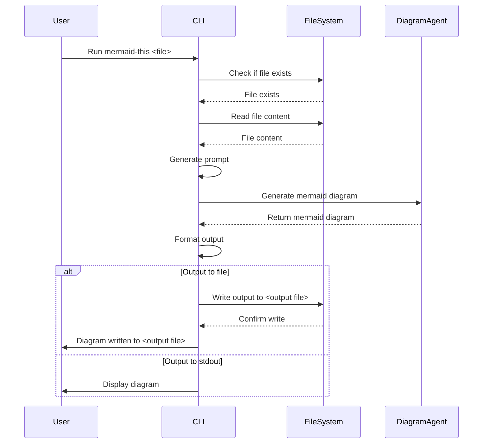

# index.ts sequence Diagram

This sequence diagram illustrates the flow of actions when the CLI tool 'mermaid-this' is executed. It shows the interaction between the User, CLI, FileSystem, and DiagramAgent.

